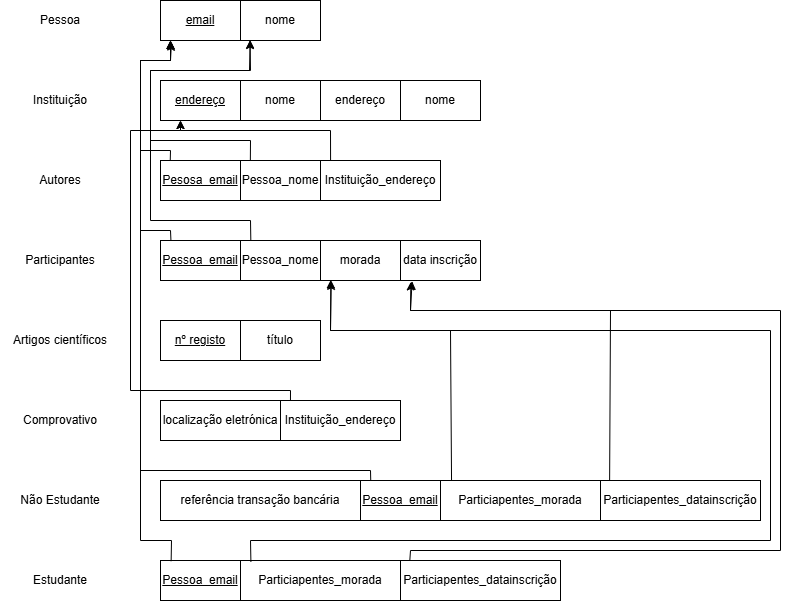

# BD: Guião 3


## ​Problema 3.1
 
### *a)*

```
- Tipo_Veículo: *código*, designação, arcondicionado
- Pesado: *Tipo_Veículo_código*, peso, passageiros
- Ligeiro: *Tipo_Veículo_código*, portas, combustivel, numlugares
- Veículo: *matricula*, marca, ano, Tipo_Veículo_código
- Balcão: *número*, nome, endereço
- Cliente: *NIF*, num_carta, nome, endereco
- Aluguer: *número*, duração, data, Cliente_NIF, Balcão_número, Veículo_matrícula
```


### *b)* 

```
Chaves Primárias:
- Tipo_Veículo: código
- Pesado: Tipo_Veículo_código
- Ligeiro: Tipo_Veículo_código
- Veículo: matricula
- Balcão: número
- Cliente: NIF
- Aluguer: número

Chaves Candidatas:
 - Balcão: nome
 - Cliente: num_carta

Chaves Estrangeiras:
- Pesado: Tipo_Veículo_código
- Ligeiro: Tipo_Veículo_código
- Veículo: Tipo_Veículo_código
- Aluguer: Cliente_NIF, Balcão_número, Veículo_matrícula
```


### *c)* 


## ​Problema 3.2

### *a)*

```
- AIRPLANE_TYPE: *Type_name*, Company, Max_seats
- AIRPLANE: *Airplane_id*, Total_no_of_seats, AIRPLANE_TYPE_Type_name
- AIRPORT: *Airport_code*, City, State, Name
- FLIGHT_LEG: *Flight_Number*, *Leg_no*, Scheduled_dep_time, Scheduled_arr_time, ARRIVAL_AIRPORT_Airport_code, DEPARTURE_AIRPORT_Airport_code
- LEG_INSTANCE: *FLIGHT_LEG_Flight_number*, *FLIGHT_LEG_Leg_no*, *Date*, No_of_avail_seats, Dep_time, Arr_time, AIRPLANE_Airplane_id, ARRIVAL_AIRPORT_Airport_code, DEPARTURE_AIRPORT_Airport_code
- SEAT: *FLIGHT_LEG_Flight_number*, *FLIGHT_LEG_Leg_no*, *Date*, Seat_no, Customer_name, Cphone
- FLIGHT: *Number*, Airplane, Weekdays
- FARE: *Code*, Amount, Restrictions, FLIGHT_Number
```


### *b)* 

```
Chaves Primárias:
- AIRPLANE_TYPE: Type_name
- AIRPLANE: Airplane_id
- AIRPORT: Airport_code
- FLIGHT_LEG: Flight_Number, Leg_no
- LEG_INSTANCE: FLIGHT_LEG_Flight_number, FLIGHT_LEG_Leg_no, Date
- SEAT: FLIGHT_LEG_Flight_number, FLIGHT_LEG_Leg_no, Date
- FLIGHT: Number
- FARE: Code
 
Chaves Candidatas:
- AIRPORT: name
- SEAT: Cphone

Chaves Estrangeiras:
- AIRPLANE: AIRPLANE_TYPE_type_name
- FLIGHT_LEG: ARRIVAL_AIRPORT_Airport_code, DEPARTURE_AIRPORT_Airport_code
- LEG_INSTANCE: FLIGHT_LEG_Flight_number, FLIGHT_LEG_Leg_no, AIRPLANE_Airplane_id, ARRIVAL_AIRPORT_Airport_code, DEPARTURE_AIRPORT_Airport_code
- SEAT: FLIGHT_LEG_Flight_number, FLIGHT_LEG_Leg_no
- FARE: FLIGHT_Number
```


### *c)* 


## ​Problema 3.3


### *a)* 2.1


### *b)* 2.2


### *c)* 2.3



### *d)* 2.4

